# Comparativo DFS - BFS - A* (Heurística Euclidiana e  Heurística de Manhattan)

  Gabriel Oliveira Alves  
  Marinêz Werneck Magalhães
  

## Introdução

 
  Na primeira etapa do problema do labirinto, foi feita a implementação dos algoritmos <a href = "https://github.com/Nerd100oculoS/labirinto-BFS-DFS-etapa1"> BFS e DFS</a> para encontrar a saída. Agora, na segunda etapa, foi desenvolvido um algoritmo complementar, derivado do BFS. Chamado de A*, onde foi empregada a Heurística Euclidiana e de Manhattan para encontrar o melhor caminho até a saída do labirinto. Por fim, há uma análise e uma comparação com todos os resultados obtidos na execução.  Nesta etapa também foram utilizadas as estruturas básicas dos respectivos repositórios, <a href = "https://github.com/mpiress/dynamic_list">Lista Dinâmica</a>, <a href = "https://github.com/mpiress/dynamic_stack">Pilha Dinâmica</a> e <a href = "https://github.com/mpiress/dynamic_queue">Fila Dinâmica</a> do professor <a href ="https://github.com/mpiress">Michel Pires</a>. Logo abaixo, estão as duas formúlas matemáticas referentes às heurísticas utilizadas. 

$$ DistânciaEuclidiana (x, y) = \sqrt{(x_{1} - x_{2})^2 + (y_{1} - y_{2})^2}$$

$$ DistânciaManhattan (x, y) = |x_{1} - x_{2}| + |y_{1} - y_{2}|$$

## Lógica

Tanto a Heurística de Euclidiana quanto a Heurística Manhattan utilizam o código BFS da estapa 1 - com algumas modificações. Para realizar a implementação destas heurísticas, fez-se necessario a criação de funções, para efetuar os cálculos de Distância Euclidiana, Distância de Manhattan, raiz quadrada e módulo.  Referente ao funcionamento do algoritmo A* (A-estrela), por ser uma otimização do BFS,neste caso, há apenas 4 posições verificáveis possíveis - dependendo da posição em que se encontra na matriz. Juntamente com a verificação, faz-se os cálculos tanto da distância Euclidiana quanto da distância de Manhattan. Logo em seguida, enfileira o melhor caminho encontrado e empilha os caminhos para um possível retorno. Portanto, ao analisar o algoritmo como um todo, percebe-se que as verificações efetutadas para ambos mudam apenas o cálculo efetuado pelas funções definidas no mesmo.

## Análise e Comparações

 
 Para análise, o tempo de execução de um algoritmo é uma maneira bastante inadequada para fins comparativos. Uma vez que, os resultados dependem do compilador e hardware utilizados, nesta análise não será feito apenas o uso do tempo de execução, mas também do número de iteracões para se chegar à saida da matriz. 
  Ao compilar e executar o código, aparecerá um Menu:   
 

   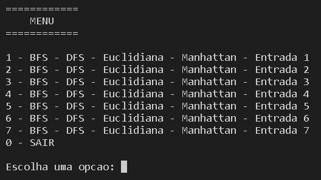</img>

  Cada uma das opções de 1 à 7, opções estas que irão buscar os arquivos de entrada, e exibirão seus resultados - caso queira encerrar, opção 0. Conforme imagens abaixo:  
  
  

   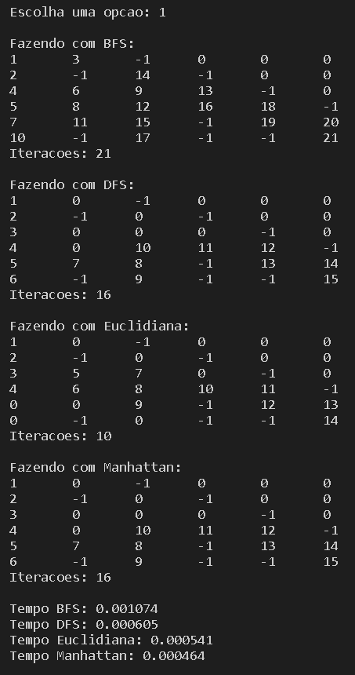</img>

 

   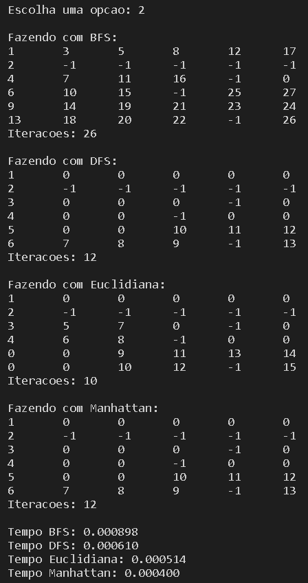</img>

   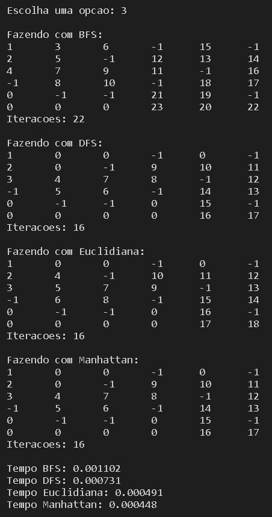</img>

   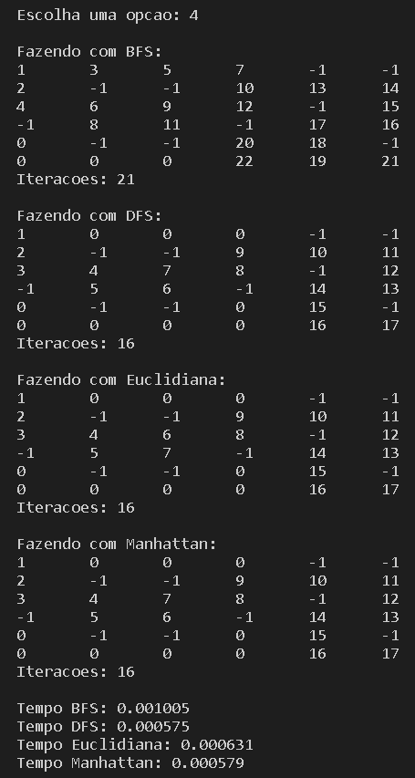</img>

   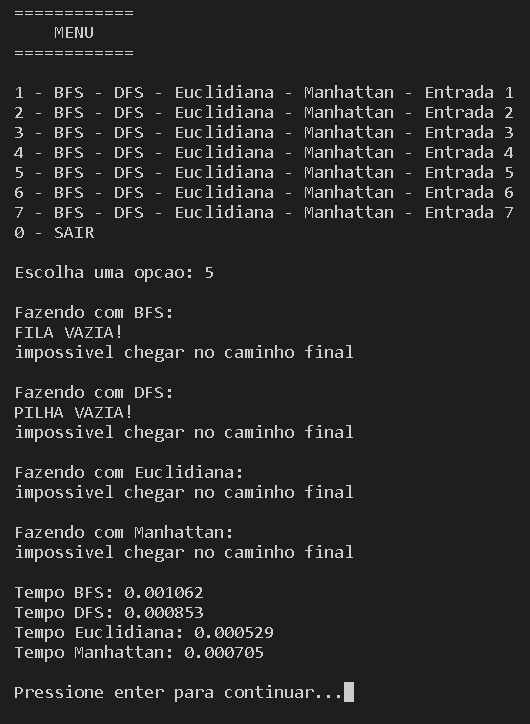</img>

   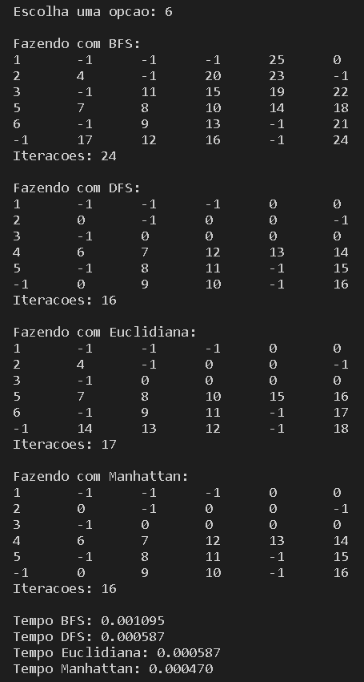</img>

   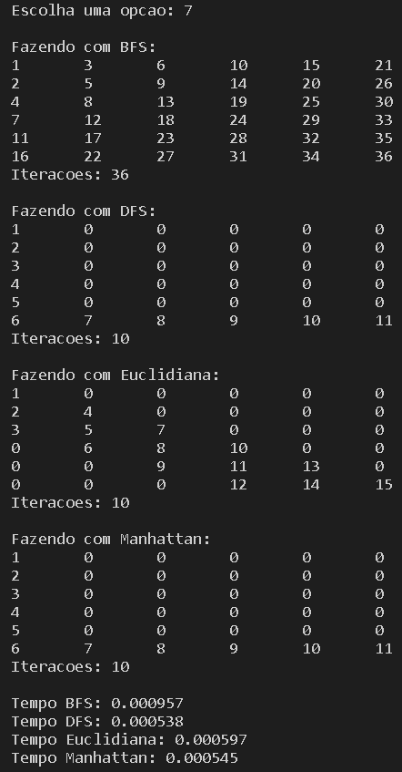</img>

Para conseguir valores mais adequados para comparação, foram realizadas 5 execuções para cada entrada em todos os algoritmos e calculadas suas médias. Dessa forma, os dados coletados - medidos pela unidade segundo(s) - foram divididos em duas tabelas:
<h3 align = "center">Valores obtidos</h3>

   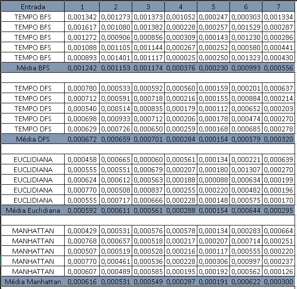</img>

<h3 align = "center">Comparação das médias</h3>

   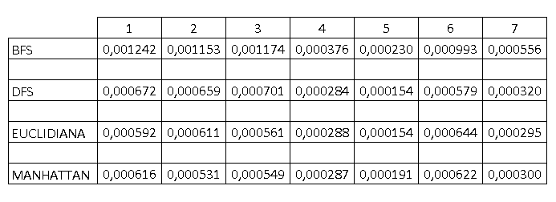</img>

Após a construção e análise das duas tabelas, plotou-se os gráficos dos resultados obtidos na execução de cada entrada para cada um dos algortimos testados. Dessa forma, melhora visualmente a análise comparativa de tempo. Abaixo, os gráficos, nomeados com suas relativas entradas:  

 

   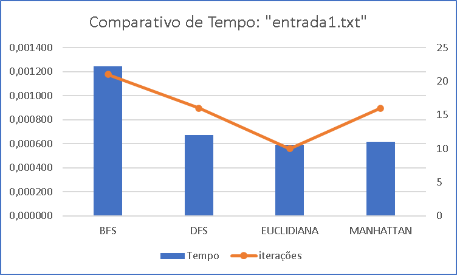</img>

 

   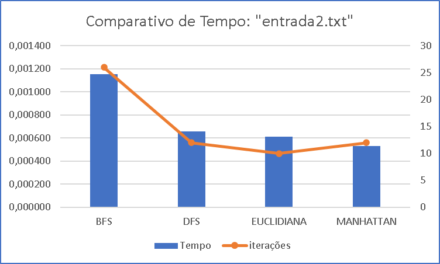</img>

   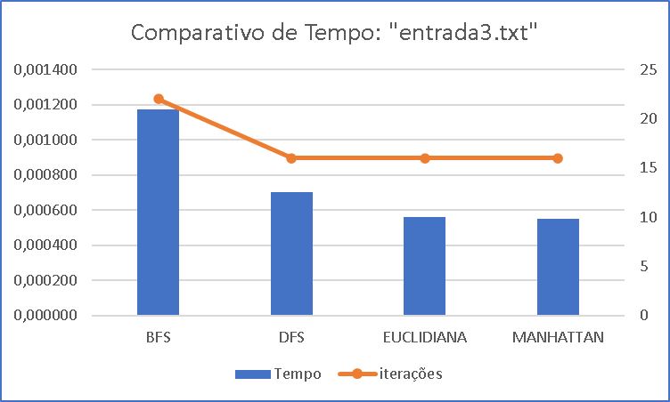</img>

   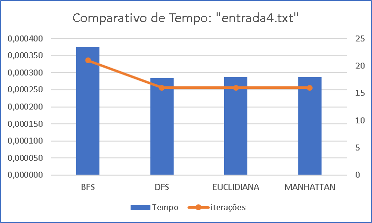</img>

   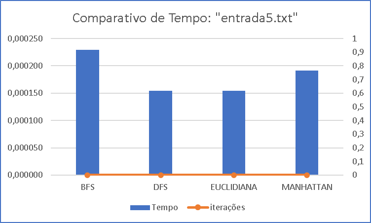</img>

   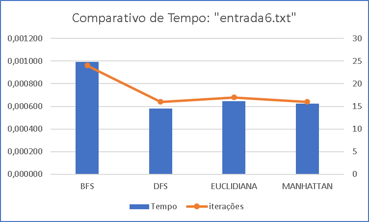</img>

   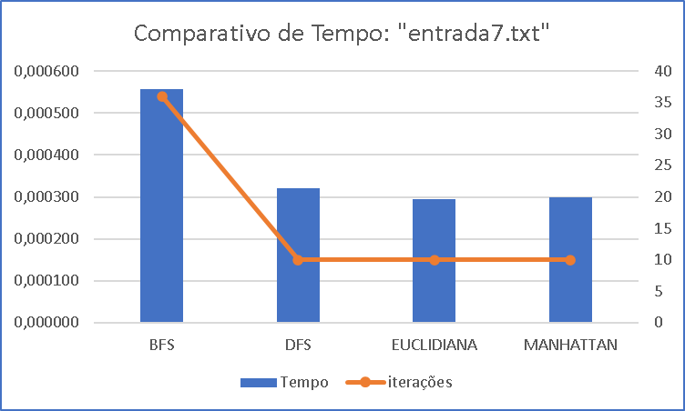</img>

## Conclusão

  Após feitas as análises e comparações, pode-se dizer que o algoritmo mais eficiente para resolucão do problema do Labirinto, é algoritmo que utiliza a Distância Euclidiana para encontrar o melhor caminho. Esta conclusão se dá não apenas pelo tempo de execução, mas também pelo número de iterações, já que a única vez em que a Heurística Euclidiana não foi superior aos demais algoritmos, foi na execução da entrada 6, na execução da entrada 5 não foi possível concluir o labirinto, pois não havia passagem até o final, informações estas disponíveis nos gráficos.   

# Compilação e Execução

Makefile realiza o procedimento de compilação e execução.

|Comando| Função|
|-----|----|
|`make clean`|Limpa tudo|
|`make r`|Executa a compilação utilizando gcc e executa o programa da pasta build após a realização da compilação.|

