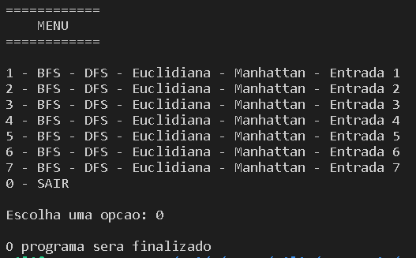

# Comparativo DFS - BFS - A* (Heurística Euclidiana e  Heurística de Manhattan)
## Introdução

 
  Na primeira etapa do problema do labirinto, foi feita a implementação dos algoritmos <a href = "https://github.com/Nerd100oculoS/labirinto-BFS-DFS-etapa1"> BFS e DFS</a> para encontrar a saída. Agora, nesta segunda e ultima etapa, foi desenvolvido um novo algoritmo, derivado do BFS. Chamado de A*, no qual, foi empregado a Heurística Euclidiana e a Heurística de Manhattan para encontrar o menor caminho até a saída do labirinto. Por fim, há uma análise e uma comparação com todos os resultados obtidos na execução.  Conforme na etapa 1, nesta etapa também foi utilizado apenas as estruturas básicas dos respectivos repositórios, <a href = "https://github.com/mpiress/dynamic_list">Lista Dinâmica</a>, <a href = "https://github.com/mpiress/dynamic_stack">Pilha Dinâmica</a> e <a href = "https://github.com/mpiress/dynamic_queue">Fila Dinâmica</a> do professor <a href ="https://github.com/mpiress">Michel Pires</a>. Logo abaixo, estão as duas formúlas matematicas referentes as heurísticas utilizadas. 

$$ DistânciaEuclidiana (x, y) = \sqrt{(x_{1} - x_{2})^2 + (y_{1} - y_{2})^2}$$

$$ DistânciaManhattan (x, y) = |x_{1} - x_{2}| + |y_{1} - y_{2}|$$

## Lógica

Tanto a Heurística de Euclidiana quanto a Heurística Manhattan utilizam o código BFS da estapa 1 - Com algumas modificações. Para realizar a implementação destas heurísticas, fez-se necessario a criação de duas funções, para efetuar os cálculos de raiz quadrada e módulo.  Referente ao funcionamento do algoritmo A* (A-estrela), por ser uma otimização do BFS,neste caso, há apenas 4 posições verificáveis possíveis - dependendo da posição em que se encontra na matriz. Juntamente com a verificação, faz-se os cálculos tanto da distância Euclidiana quanto da distância de Manhattan. Logo em seguida, enfileira o menor caminho encontrado e empilha os caminhos para um possível retorno se necessário. Portanto, ao analisar o algoritmo como um todo, percebe-se que as verificações efutadas para ambos, são relativamente idênticas, mudando apenas o cálculo efetuado pelas funções definidas no mesmo.

## Análise e Comparações

 
 Para análise, deve ser esclarecido que o tempo de execução de um algoritmo é uma maneira bastante inadequada para fins comparativos. Uma vez que, os resultados dependem do compilador e hardware utilizado. Entretanto, para esta análise, o tempo de execução fez-se importante para comparar como a 
diferença na implementação pode implicar em um aumento de performace na resolução do problema. 
  Ao compilar e executar o código, aparecerá um Menu:   
 

   </img>

  Cada uma das opções de 1 à 7 irão encaminhar para suas respectivas entradas e exibirão seus resultados, conforme as imagens abaixo:  
  
  

   </img>

 

   </img>

   </img>

   </img>

   </img>

   </img>

   </img>

E caso queira encerrar a execução, opção 0: 

   </img>

# Compilação e Execução

Makefile realiza o procedimento de compilação e execução.

|Comando| Funcao|
|----|----|
|`make clean`|Limpa tudo|
|`make r`|Executa a compilação utilizando gcc e executa o programa da pasta build após a realização da compilação.|

